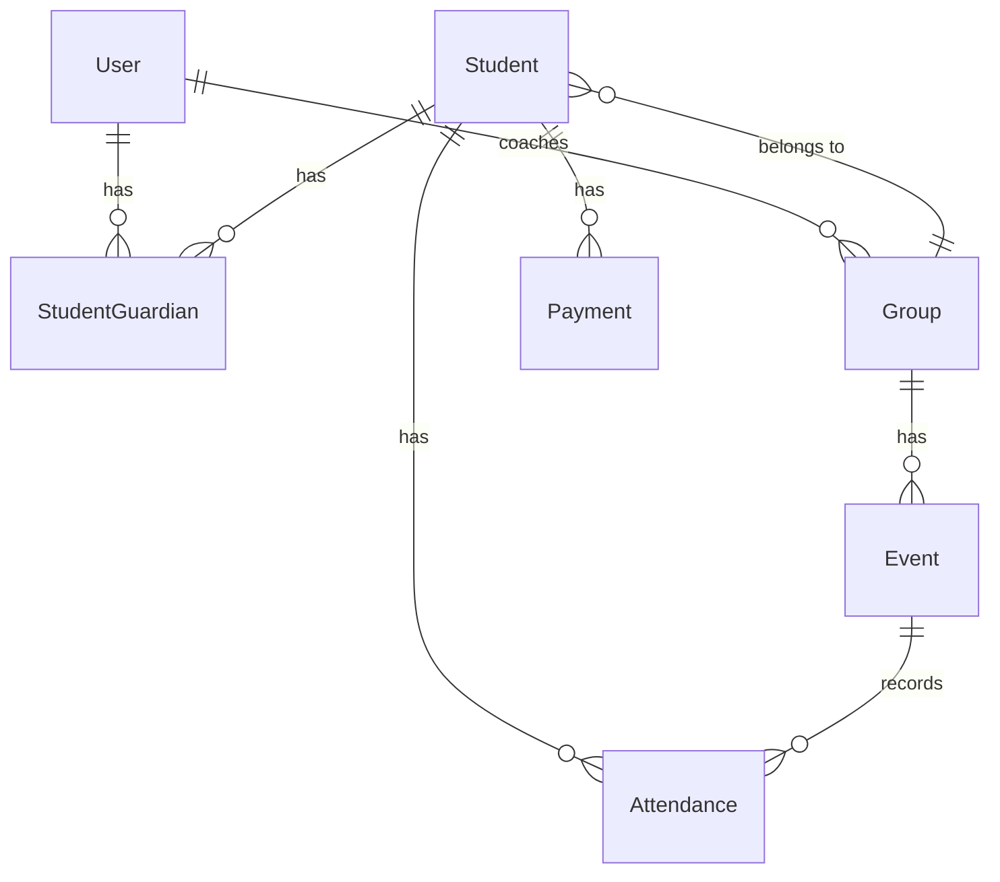

# Football Academy Management System - Analysis and Completion Plan

## Project Overview

The Football Academy Management System is a FastAPI-based backend application designed to manage a youth football academy's operations, including student enrollment, attendance tracking, payment management, coaching groups, and event scheduling.

## Technology Stack

- **Backend Framework**: FastAPI with Uvicorn
- **Database ORM**: SQLAlchemy 1.4
- **Database**: PostgreSQL (configured) / SQLite (default fallback)
- **Authentication**: JWT tokens with OAuth2 password flow
- **Migration Tool**: Alembic
- **Data Validation**: Pydantic

## Current Implementation Status

### Completed Components

#### Data Models
All core domain models are fully implemented:
- **User**: Phone-based authentication with role-based access control
  - Roles: super_admin, admin, coach, parent
- **Student**: Student profiles with group assignment and balance tracking
- **StudentGuardian**: Many-to-many relationship linking students to parent users
- **Group**: Training groups with coach assignment
- **Event**: Scheduled activities (training, game, medical) for groups
- **Attendance**: Student attendance tracking with status and optional evaluation marks
- **Payment**: Financial transaction records with payment methods and periods

#### Authentication and Authorization
- JWT-based authentication with phone number as username
- OAuth2 password flow implementation
- Role-based access control with dependencies
- User creation endpoint (super admin only)

#### Student Management API
Complete CRUD operations for students:
- Create student (admin only)
- List students (with role-based filtering)
- Get student details (with guardian information)
- Update student information
- Delete student
- Add guardian relationship to student

### Identified Gaps and Incomplete Features

#### Missing API Endpoints

**Group Management**
- No endpoints for creating, updating, or deleting groups
- No endpoint to list groups or view group details
- No endpoint to assign students to groups
- No endpoint to assign coaches to groups

**Event Management**
- No endpoints for creating, updating, or deleting events
- No endpoint to list events by group or date range
- No endpoint for event scheduling
- No calendar view functionality

**Attendance Management**
- No endpoints for recording attendance
- No bulk attendance marking for events
- No attendance history retrieval
- No attendance statistics or reports

**Payment Management**
- No endpoints for recording payments
- No payment history retrieval
- No balance calculation or update logic
- No payment period tracking
- No financial reports or analytics

**User Management**
- Only user creation endpoint exists
- Missing: list users, update user, delete user, change password

**Coach-Specific Features**
- No endpoints for coaches to view their assigned groups
- No endpoints for coaches to mark attendance
- No endpoints for coaches to view their schedule

**Parent-Specific Features**
- No endpoints for parents to view their children's attendance
- No endpoints for parents to view payment history
- No endpoints for parents to view upcoming events

#### Missing Schemas
- No Pydantic schemas for Group
- No Pydantic schemas for Event
- No Pydantic schemas for Attendance
- No Pydantic schemas for Payment
- No schemas for User management beyond authentication

#### Missing Business Logic

**Balance Management**
- No automatic balance update when payment is recorded
- No logic to calculate outstanding balance
- No payment reminder system

**Attendance Rules**
- No validation for duplicate attendance records
- No business rules for late marking cutoff
- No automatic attendance status determination

**Group Capacity**
- No group size limits or capacity management
- No waiting list functionality

**Event Conflicts**
- No validation to prevent overlapping events for same group
- No coach schedule conflict detection

#### Configuration Issues
- Config file references PostgreSQL but defaults to SQLite
- Environment variables from .env not properly loaded in config
- CORS origins set to wildcard (security concern)

#### Missing Features

**Reporting and Analytics**
- No attendance reports
- No payment reports
- No student progress tracking
- No coach performance metrics

**Notifications**
- No notification system for parents
- No reminder system for upcoming events
- No payment due notifications

**Search and Filtering**
- No search functionality for students
- No filtering by group, status, or date ranges
- No pagination for large datasets (basic limit/offset only)

**Audit and History**
- No audit trail for changes
- No timestamp tracking for record modifications
- No soft delete functionality (students are hard deleted)

## Recommended Completion Plan

### Phase 1: Core API Completion

**Priority 1: Group Management**
- Create router for groups
- Implement schemas for Group (create, update, response)
- Endpoints: CRUD operations, assign coach, list students in group

**Priority 2: Event Management**
- Create router for events
- Implement schemas for Event (create, update, response)
- Endpoints: CRUD operations, list by group, list by date range

**Priority 3: Attendance Management**
- Create router for attendance
- Implement schemas for Attendance (create, update, response)
- Endpoints: mark attendance, bulk mark, view history, statistics

**Priority 4: Payment Management**
- Create router for payments
- Implement schemas for Payment (create, response, summary)
- Endpoints: record payment, view history, calculate balance
- Implement balance update logic

### Phase 2: Role-Specific Features

**Coach Features**
- View assigned groups endpoint
- View group schedule endpoint
- Mark attendance for own groups endpoint
- View student evaluations endpoint

**Parent Features**
- View children's attendance endpoint
- View payment history endpoint
- View upcoming events endpoint
- View balance and dues endpoint

### Phase 3: Business Logic Enhancement

**Balance Management**
- Automatic balance calculation
- Payment period validation
- Outstanding balance alerts

**Validation Rules**
- Event conflict detection
- Attendance duplicate prevention
- Group capacity limits

**Configuration Improvement**
- Proper environment variable loading
- Database URI from environment
- Secure CORS configuration

### Phase 4: Advanced Features

**Search and Filtering**
- Student search by name
- Filter students by group, status
- Filter events by date range
- Filter payments by period

**Reporting**
- Attendance summary reports
- Payment summary reports
- Group performance reports

**Audit Trail**
- Created/updated timestamps on all models
- Soft delete for students
- Change history tracking

## Data Flow Architecture

### Authentication Flow
1. User submits phone and password
2. System validates credentials
3. JWT token generated with user role
4. Token used for subsequent requests
5. Dependencies validate token and extract user context

### Student Management Flow
1. Admin creates student record
2. Admin assigns student to group
3. Admin links guardian (parent user) to student
4. Parent can view their linked students
5. Coach can view students in their groups

### Attendance Flow (To Be Implemented)
1. Coach views event for their group
2. Coach marks attendance for each student
3. System validates no duplicate attendance
4. System records attendance with optional evaluation mark
5. Parent can view attendance history

### Payment Flow (To Be Implemented)
1. Admin records payment for student
2. System validates payment period
3. System updates student balance
4. System creates payment record
5. Parent can view payment history

## Database Schema Relationships

## Security Considerations

**Current Implementation**
- JWT token-based authentication
- Role-based access control
- Password hashing with bcrypt

**Recommendations**
- Implement token refresh mechanism
- Add rate limiting for authentication endpoints
- Configure CORS origins properly (remove wildcard)
- Add request validation middleware
- Implement API key for internal services
- Add logging for security events

## API Structure Recommendations

### Endpoint Organization

**Authentication**: /api/v1/auth
- POST /login - Login and get token
- POST /users - Create user (super admin)
- GET /me - Get current user profile
- PUT /me/password - Change own password

**Students**: /api/v1/students
- GET / - List students
- POST / - Create student
- GET /{id} - Get student details
- PUT /{id} - Update student
- DELETE /{id} - Delete student
- POST /{id}/guardians/{user_id} - Add guardian

**Groups**: /api/v1/groups (To Be Implemented)
- GET / - List groups
- POST / - Create group
- GET /{id} - Get group details
- PUT /{id} - Update group
- DELETE /{id} - Delete group
- GET /{id}/students - List students in group
- PUT /{id}/coach/{user_id} - Assign coach

**Events**: /api/v1/events (To Be Implemented)
- GET / - List events (with filters)
- POST / - Create event
- GET /{id} - Get event details
- PUT /{id} - Update event
- DELETE /{id} - Delete event
- GET /group/{group_id} - List events for group

**Attendance**: /api/v1/attendance (To Be Implemented)
- POST / - Mark attendance
- POST /bulk - Mark attendance for multiple students
- GET /event/{event_id} - Get attendance for event
- GET /student/{student_id} - Get attendance history
- PUT /{id} - Update attendance record

**Payments**: /api/v1/payments (To Be Implemented)
- GET / - List payments (with filters)
- POST / - Record payment
- GET /{id} - Get payment details
- GET /student/{student_id} - Get payment history
- GET /student/{student_id}/balance - Get student balance

**Reports**: /api/v1/reports (To Be Implemented)
- GET /attendance - Attendance summary report
- GET /payments - Payment summary report
- GET /groups/{id}/performance - Group performance report

## Next Steps

To continue and complete the project, the following actions should be taken in order:

1. **Implement Group Management Module**
   - Create schemas for Group operations
   - Create router with CRUD endpoints
   - Add group assignment logic
   - Integrate with existing student and user models

2. **Implement Event Management Module**
   - Create schemas for Event operations
   - Create router with CRUD endpoints
   - Add scheduling logic
   - Add conflict detection

3. **Implement Attendance Management Module**
   - Create schemas for Attendance operations
   - Create router with marking and viewing endpoints
   - Add validation for duplicates
   - Add bulk marking capability

4. **Implement Payment Management Module**
   - Create schemas for Payment operations
   - Create router with recording and viewing endpoints
   - Implement balance calculation and update logic
   - Add payment period validation

5. **Enhance Configuration**
   - Fix database connection to use PostgreSQL from environment
   - Load environment variables properly
   - Configure CORS securely

6. **Add Search and Filtering**
   - Implement query parameters for filtering
   - Add search functionality
   - Improve pagination

7. **Implement Reporting**
   - Create report endpoints
   - Add data aggregation logic
   - Generate summaries and statistics

8. **Add Audit and Timestamps**
   - Add created_at and updated_at to all models
   - Implement soft delete
   - Add change tracking

9. **Testing**
   - Write unit tests for business logic
   - Write integration tests for API endpoints
   - Add test fixtures and data

10. **Documentation**
    - Complete API documentation with examples
    - Add deployment guide
    - Create user role documentation
